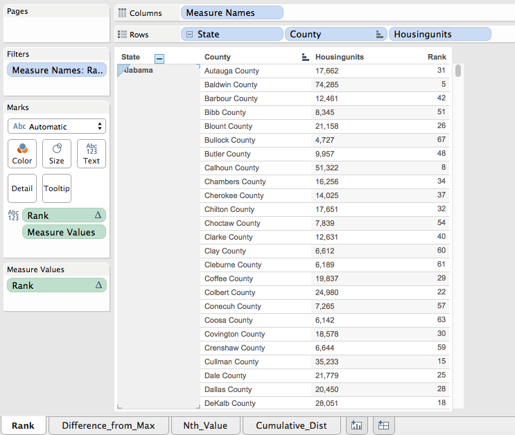
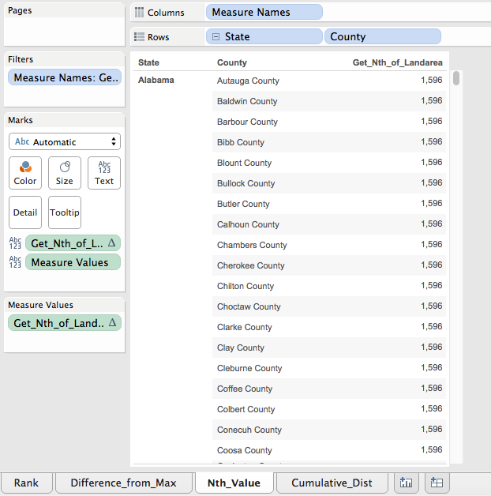
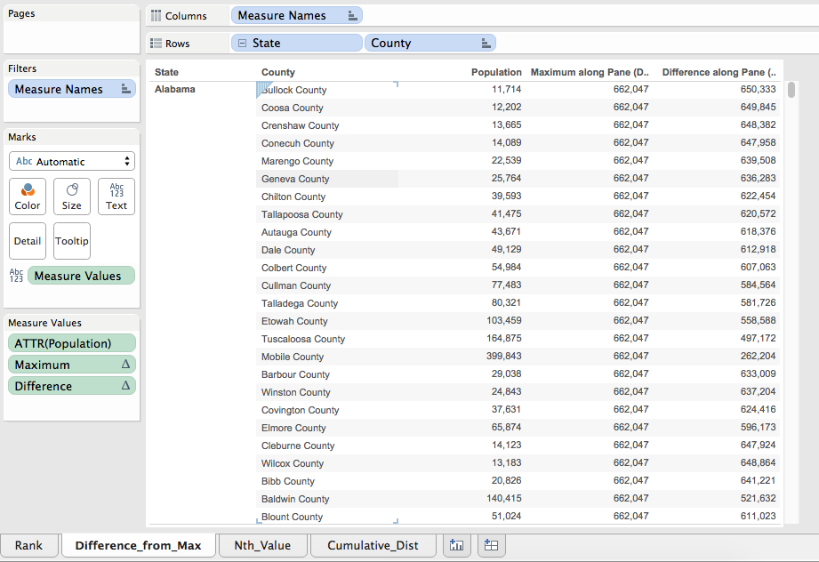
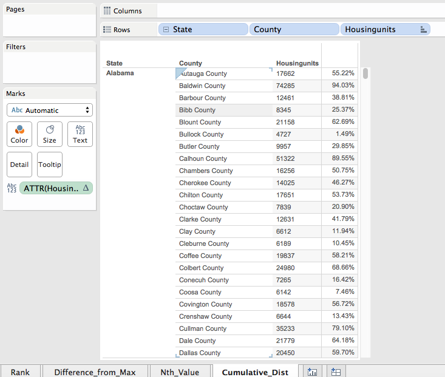

**By: Mitali Sathaye and Saqib Ali**

**Load Packages:**
```{r}
source("../.rProfile", echo = FALSE)
```

**This is what our full Counties table looks like:**
```{r}
source("../01 SQL Crosstabs/Counties.R", echo = TRUE)
```

Crosstabs
---


**Rank**
---
*For our first crosstab we ranked the number of housing units for each state from greatest to least.*
```{r}
source("../01 SQL Crosstabs/Rank.R", echo = TRUE)
```

**Tableau version:**



**Nth Value**
---
*For our second crosstab we found the nth(second) largest land area for each state and reproduced that number for all the counties in that particular state. *
```{r}
source("../01 SQL Crosstabs/NthValue.R", echo = TRUE)
```

**Tableau version:**



**Max Value Difference**
---
*For our third crosstab we found the largest value of the population for each state. We then subtracted each counties population from the value found. We did this for each state.*


```{r}
source("../01 SQL Crosstabs/MaxValueDiff.R", echo = TRUE)
```

**Tableau version:**



**Cumulative Distribution**
---
*For our fourth crosstab we found the largest value of housing units for each state. We then found out what the portion is of each county's population relative to the value found. We did this for each state.*
```{r}
source("../01 SQL Crosstabs/Cume_Dist.R", echo = TRUE)
```
**Tableau Version**


